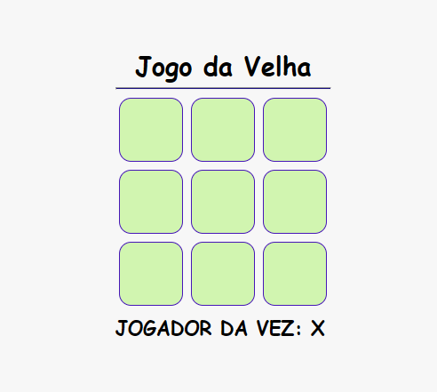

# Jogo da Velha 🌇

Este é um simples jogo da velha (Tic-Tac-Toe) desenvolvido com HTML, CSS e JavaScript. O jogo permite que dois jogadores se enfrentem em um tabuleiro 3x3. O objetivo é conseguir três marcas consecutivas, seja na horizontal, vertical ou diagonal.

## Screenshot 🔥



## Tecnologias Utilizadas ✨

- **HTML:** Estrutura do jogo.
- **CSS:** Estilização dos elementos do jogo.
- **JavaScript:** Lógica do jogo, incluindo a verificação das condições de vitória e alternância de jogadores.

## Como Jogar 📃

1. Abra o arquivo `index.html` em um navegador web.
2. Clique nos botões dentro do tabuleiro para fazer sua jogada.
3. O jogo irá alternar automaticamente entre os jogadores.
4. O primeiro jogador a alinhar três marcas vence o jogo.

## Estrutura do Projeto ✨

```bash
├── assets
│   ├── css
│   │   └── style.css
│   ├── js
│   │   └── script.js
│   └── screenshot.png
├── index.html
└── README.md
